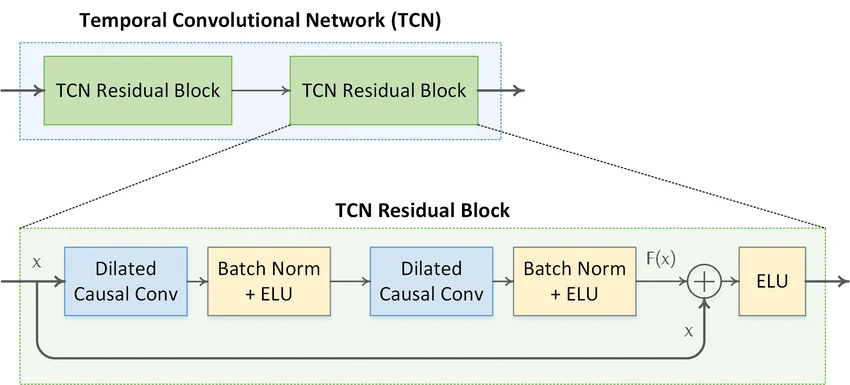
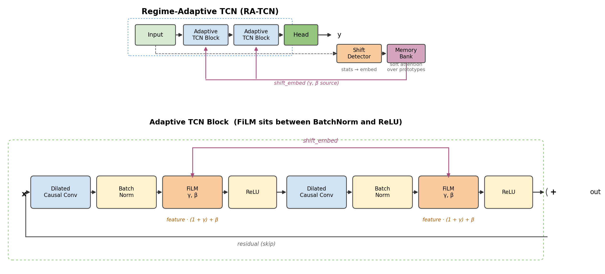

# RA-TCN: Regime-Adaptive Temporal Convolutional Network

A TCN variant that stays accurate when the input time series undergoes distribution shift (mean jumps, variance changes, frequency shifts). A vanilla TCN trained on one regime collapses when the data regime changes; RA-TCN detects the shift and modulates its internal features on the fly using FiLM.

## The problem

Neural networks are not scale-invariant. Weights, biases, and BatchNorm running statistics are all fitted to the training distribution. If the input regime shifts at inference time (e.g. stock market from calm to shock, temperature from summer to winter), the learned features arrive at wrong magnitudes and the predictions break.

Retraining is costly and risks catastrophic forgetting. RA-TCN's answer: train once over several regimes, learn to *adapt* to the current one at inference time.

## How it works

### Baseline: Vanilla TCN



A stack of residual blocks; each block is two dilated causal convolutions with BatchNorm and a nonlinearity, plus a skip connection. No mechanism to react to distribution shift at inference time.

### RA-TCN



Same convolutional backbone, but every block gets a **FiLM layer inserted between BatchNorm and ReLU**. The FiLM γ, β values are produced per-sample from a `shift_embed` vector, which itself comes from a side branch (`ShiftDetector` → `RegimeMemoryBank`) that summarises the current input window's statistics. The conv filters and BN running stats stay frozen across regimes — FiLM does the per-regime correction right before ReLU makes its sign decisions.

- **ShiftDetector** ([models.py:75](models.py#L75)) — computes `[mean, std, skew, kurtosis]` of the input window and maps them through an MLP to a `shift_embed` vector.
- **RegimeMemoryBank** ([models.py:151](models.py#L151)) — keeps K learned regime prototypes. Cosine-similarity softmax produces a weighted blend; output is `0.9 * shift_embed + 0.1 * retrieved` (soft attention, not hard classification).
- **FiLMModulator** ([models.py:107](models.py#L107)) — turns `shift_embed` into per-channel `γ, β` and applies `feature * (1 + γ) + β` right after BatchNorm. Conv weights and BN running stats stay untouched; FiLM corrects the feature magnitudes before ReLU makes irreversible sign decisions.
- **AdaptiveTCNBlock** ([models.py:129](models.py#L129)) — standard dilated causal conv + BatchNorm + FiLM + ReLU + dropout, with a residual skip.

Training is fully end-to-end: MSE loss backpropagates through the conv weights, FiLM nets, shift-detector MLP, and memory-bank prototypes simultaneously.

## Why not just train a vanilla TCN on all regimes?

Partially works, but the conv filters have to compromise across regimes, and BatchNorm's global running stats don't match any single regime well. RA-TCN separates concerns: conv filters learn *patterns*, FiLM handles *scale* per-regime.

## Files

- [models.py](models.py) — `VanillaTCN` and `RATCN` (plus `CausalConv1d`, `TCNBlock`, `ShiftDetector`, `FiLMModulator`, `AdaptiveTCNBlock`, `RegimeMemoryBank`).
- [dataset.py](dataset.py) — synthetic 3-regime series (Calm → Shock → Recovery) and a sliding-window `TimeSeriesDataset`.
- [demo.py](demo.py) — trains Vanilla-on-A-only, Vanilla-on-all, and RA-TCN-on-all; writes `ra_tcn_demo.png` with per-regime MSE and rolling error plots.
- [app.py](app.py) — Streamlit dashboard for interactive exploration.
- [make_ratcn_diagram.py](make_ratcn_diagram.py) — regenerates `image_ratcn.png` (the RA-TCN architecture figure).

## Running

```bash
# setup
python -m venv venv
venv/Scripts/activate          # Windows
pip install torch numpy matplotlib streamlit plotly

# offline demo → ra_tcn_demo.png
python demo.py

# interactive app
streamlit run app.py
```

## Default hyperparameters

| | value |
|---|---|
| lookback | 100 |
| horizon | 10 |
| hidden channels | 64 |
| layers | 4 (dilations 1, 2, 4, 8) |
| kernel size | 7 |
| shift embed dim | 32 |
| regime prototypes (K) | 8 |
| memory bank momentum | 0.9 |

## When this matters

Domains with recurring but non-stationary regimes: financial markets (calm / volatility shock / recovery), weather and climate, industrial sensor streams with operating-mode changes, physiological signals across activity states.
